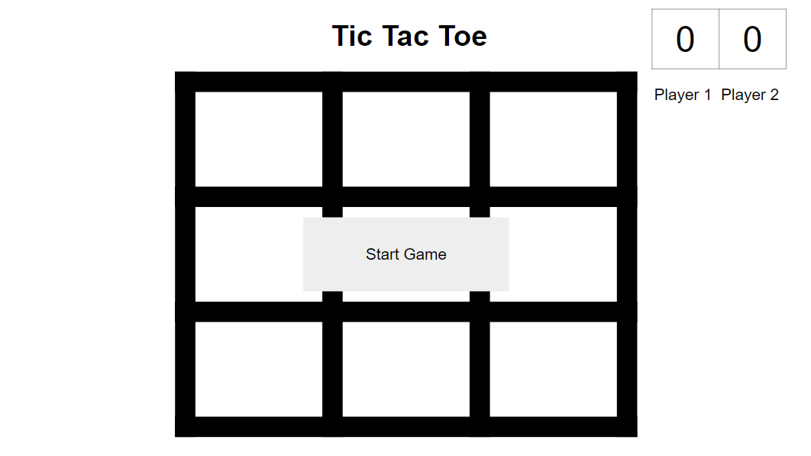

# Tic Tac Toe

## Description

A browser-based Tic Tac Toe game coded in JavaScript, HTML and CSS.

## Planning Process

### User Stories

#### MVP

- As a user, I want a browser-based interface so that I can play the game.
- As a user, I want to place my token so that I can interact with the game.
- As a user, I want the game to reach a win state so that I know who won and can play again.

#### Bronze

- As a user, I want the game to have a reset button to clear the board and play agian.
- As a user, I want the game to have a timer to determine how long.

#### Silver

- As a user, I want the game to have CSS style to change background colors and tokens to determine whose turn it is.

#### Gold

- As a user, I want to be able to upload my own image as my token so that I can customize the game.
- As a user, I want there to be an option for a hint that will give the best response for game move.
- As a user, I want there to be an AI option which gives us an option for difficulty level.

### Wireframes

